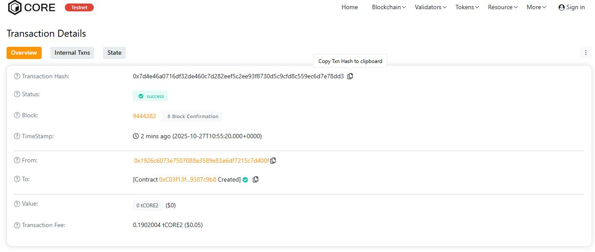

# TrustSync

## Project Description

TrustSync is a decentralized trust and reputation management system built on blockchain technology. It enables two parties to create transparent, verifiable agreements with built-in reputation scoring mechanisms. The smart contract facilitates trustless collaboration by tracking agreement completion, managing disputes, and maintaining an immutable reputation history for all participants.

The system automatically rewards users for successfully completed agreements and applies reputation penalties for disputes, creating a self-regulating ecosystem that incentivizes honest behavior and successful collaboration.

## Project Vision

Our vision is to revolutionize how trust is established in decentralized environments by creating a universal reputation layer for collaborative agreements. TrustSync aims to:

- **Eliminate intermediaries** in peer-to-peer transactions by providing blockchain-based trust verification
- **Create transparency** through immutable reputation scores that reflect user reliability
- **Enable global collaboration** between parties who have never met, backed by verifiable track records
- **Build a decentralized reputation economy** where trust becomes portable across platforms and applications

We envision a future where TrustSync becomes the foundation for decentralized freelancing, service exchanges, peer-to-peer lending, and any scenario requiring trust between unknown parties.

## Key Features

### 1. **User Registration System**
- Simple onboarding process for new users
- Initial reputation score of 100 points for all users
- Unique profile tracking for each Ethereum address

### 2. **Agreement Creation**
- Create binding agreements between two registered parties
- Lock funds in the smart contract for security
- Attach descriptions and metadata to each agreement
- Automatic timestamp recording for audit trails

### 3. **Agreement Completion**
- Either party can mark an agreement as completed
- Automatic reputation rewards (+10 points for both parties)
- Secure fund transfer to the service provider
- Permanent completion record on-chain

### 4. **Dispute Resolution**
- Built-in dispute mechanism for failed agreements
- Reputation penalties (-5 points) for disputing parties
- Automatic refund to the agreement initiator
- Dispute tracking in user profiles

### 5. **Reputation Tracking**
- Real-time reputation scores based on agreement history
- Counters for completed and disputed agreements
- Transparent view of any user's trustworthiness
- Reputation as a portable trust credential

### 6. **Agreement History**
- Complete history of all user agreements
- Query any user's past collaborations
- Transparency for informed decision-making

## Future Scope

### Short-term Enhancements
- **Multi-signature completion**: Require both parties to confirm completion
- **Milestone-based agreements**: Break large projects into verifiable milestones
- **Time-locked agreements**: Add deadline mechanisms with automatic dispute triggers
- **Rating system**: Allow parties to rate each other beyond binary complete/dispute

### Medium-term Development
- **Arbitration layer**: Introduce trusted arbitrators for complex disputes
- **Reputation tiers**: Create badge systems for highly reputable users
- **Escrow extensions**: Support partial payments and phased releases
- **Multi-party agreements**: Expand beyond two-party limitations
- **Agreement templates**: Pre-built templates for common use cases

### Long-term Vision
- **Cross-chain reputation**: Port reputation scores across multiple blockchains
- **AI-powered risk assessment**: Predict agreement success rates based on historical data
- **Decentralized arbitration DAO**: Community-governed dispute resolution
- **Integration marketplace**: API for DApps to leverage TrustSync reputation
- **Reputation staking**: Allow users to stake reputation for higher-value agreements
- **Insurance protocols**: Optional insurance pools for high-value agreements

### Potential Applications
- Decentralized freelancing platforms
- Peer-to-peer lending and borrowing
- Supply chain verification
- Rental and sharing economy services
- Educational credential verification
- Community governance systems

---

## Technical Stack

- **Solidity**: ^0.8.0
- **Blockchain**: Ethereum (compatible with EVM chains)
- **Development**: Hardhat/Truffle

## Installation & Deployment

1. Install dependencies:
```bash
npm install --save-dev hardhat @nomiclabs/hardhat-ethers ethers
```

2. Compile the contract:
```bash
npx hardhat compile
```

3. Deploy to network:
```bash
npx hardhat run scripts/deploy.js --network <your-network>
```

## License

MIT License - See LICENSE file for details

## Contributing

Contributions are welcome! Please open an issue or submit a pull request for any improvements.

## Contact

For questions or collaboration opportunities, please open an issue in this repository.

---

**Built with trust, powered by blockchain** 🤝⛓️

H address:0x7d4e46a0716df32de460c7d282eef5c2ee93f8730d5c9cfd8c559ec6d7e78dd3


